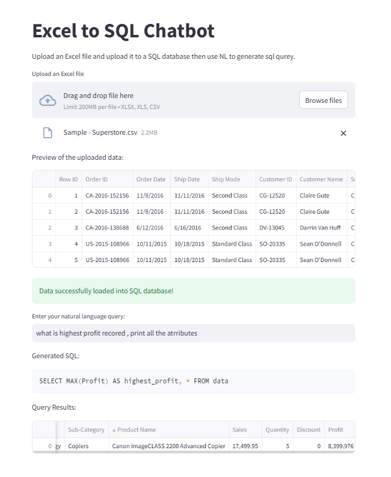

# Excel to SQL with Natural Language Query

This project allows users to upload an Excel or CSV file, load it into a SQLite database, and generate SQL queries using natural language input.

## Features

- Upload Excel or CSV files
- Automatically detect file encoding
- Load data into an in-memory SQLite database
- Generate SQL queries from natural language input using Ollama
- Display query results

## Requirements

- Python 
- Streamlit
- Pandas
- SQLAlchemy
- Chardet
- Ollama

## Requirements

1. Install the required packages:
    ```sh
    pip install streamlit pandas sqlalchemy chardet ollama
    ```

## Example

1. Upload any Excel file

2. Enter your query in natural language.

3. The app will generate and display the SQL query.

4. The app will display the query results:

## Screenshot


## License

This project is licensed under the MIT License.